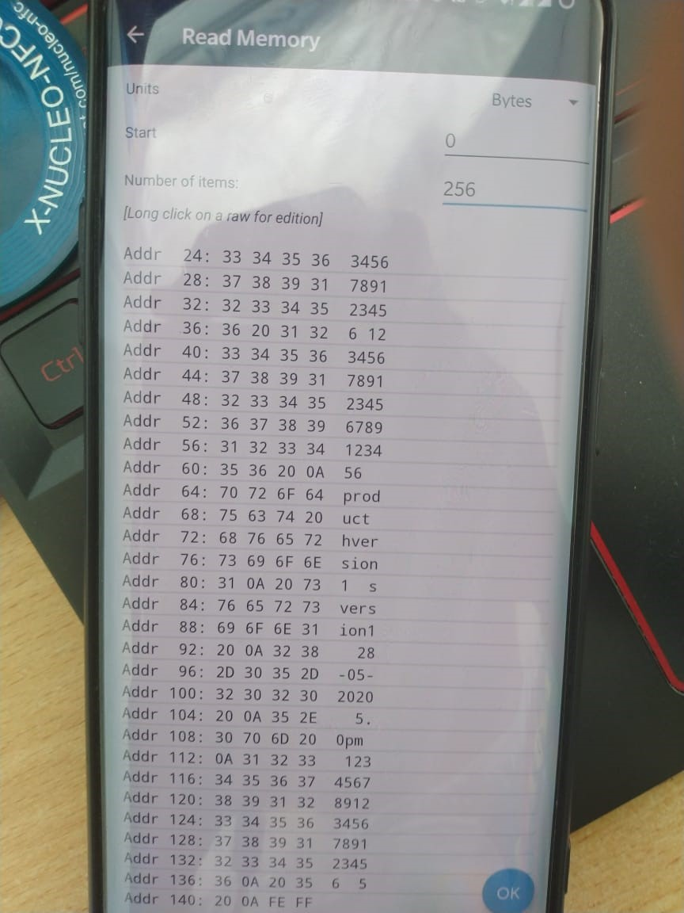

 

  

  <h3 align="center">Research and development the device for product tracking using STM(X-Nucleo-NFC04A1) 
  </h3>
    

    Academic Tasks
     
     
  

## Tasks

 

- Analysis of existing tracking technologies, types and standarts using RFID's.  
- Analysis of data and communication security methods. 
- Creation of file system on RFID Flash memory.

## Firmware development:
To develope  the firmware for the st25dv04k, The X-NUCLEO-NFC04A1 dynamic NFC/RFID tag IC expansion board is used. It is based on the ST25DV04K NFC Type V/RFID tag IC with a dual interface 4 Kbits EEPROM that also features an I²C interface. It can be powered by the pin of Arduino connector or directly by the received carrier electromagnetic field.The MCU is STM32L152RE Nucleo board is connected to X-NUCLEO-NFC04A1 expansion board, which is shown in below figure. The power supply for the stm32l152re and the nfc04a1 is the usb arduino connector. The nfc04a1 is mounted on the stm32l152re as shown in the figure.

 

 

 

## Configuration of stm32l152RE

 

To get the source code for the for the nfc04a1 and the stm32l152re, stmcubemx software is used. The stm32l152re nucleo board  is selected in cubemx In the additional software x cube nfc4 is selected . And the code is generated in the spcified folder.

 

 

 

 

##	Programming EEPROM

 

While programming RFID tag, depends on the application various content will  be added to the non volatile EEPROM memory, but in most application the following different variables are used and they are declared in structure for the collection of different content.

- CustomerOrderCode:  A separate ID code for user order.

- InternalFactoryCode:  unique factory code is stored.

- ProductName: the name of the product

- HWVersion: Version of the hardware

- SWVersion: Version of the software

- ManufacturingDate: date of the manufacture of product

- ManufacturingTime: time of the manufacture of product

- QualityControlPersonID: ID of the person who is responsible for quality

 

## Data in tag memory

 

A smart phone with NFC enabled st25nfc app installed is used as reader.The data which are stored in the eeprom  of the  tag is stored energy-independently in Tag Flash (i.e) after disconnecting the power suply, the data in the eeprom of tag will not get deleted, it will remain same.

The data which are stored in the tag eeprom is readable by the android app which is shown below.

 

 

 
